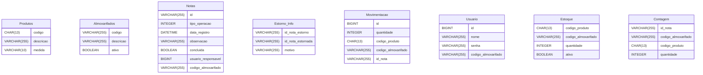

# Delphi_Service_Cadastro_Produtos

# Estoque de Produtos documentation
## Summary

- [Introduction](#introduction)
- [Database Type](#database-type)
- [Table Structure](#table-structure)
	- [Produtos](#produtos)
	- [Almoxarifados](#almoxarifados)
	- [Notas](#notas)
	- [Estorno_Info](#estorno_info)
	- [Movimentacao](#movimentacao)
	- [Usuario](#usuario)
	- [Estoque](#estoque)
	- [Contagem](#contagem)
- [Relationships](#relationships)
- [Database Diagram](#database-diagram)
- [Sql Create Tables](#sql-create-tables)

## Introduction

## Database type

- **Database system:** MySQL
## Table structure

### Produtos

| Name          | Type         | Settings        | References | Note |
| ------------- | ------------ | --------------- | ---------- | ---- |
| **codigo**    | CHAR(13)     | 🔑 PK, not null |            |      |
| **descricao** | VARCHAR(255) | not null        |            |      |
| **medida**    | VARCHAR(10)  | not null        |            |      | 


### Almoxarifados

| Name          | Type         | Settings                | References | Note |
| ------------- | ------------ | ----------------------- | ---------- | ---- |
| **codigo**    | VARCHAR(255) | 🔑 PK, not null         |            |      |
| **descricao** | VARCHAR(255) | not null                |            |      |
| **ativo**     | BOOLEAN      | not null, default: true |            |      | 


### Notas

| Name                    | Type         | Settings                 | References 			 | Note |
| ----------------------- | ------------ | ------------------------ | ---------------------  | ---- |
| **id**                  | VARCHAR(255) | 🔑 PK, not null          |            			 |      |
| **tipo_operacao**       | INTEGER      | not null, (entrada, saida, balanço)                 |            			 |      |
| **data_registro**       | DATETIME     | not null                 |           			 | data + hora      |
| **observacao**          | VARCHAR(255) | null                     |           			 |      |
| **concluida**           | BOOLEAN      | not null, default: false |           			 |      |
| **usuario_responsavel** | BIGINT       | not null                 | **Usuario.id**         |      |
| **codigo_almoxarifado** | VARCHAR(255) | not null                 | **Almoxarifado.codigo**|      | 


### Estorno_Info

| Name                  | Type         | Settings         | References       | Note |
| --------------------- | ------------ | ---------------- | ---------------- | ---- |
| **id_nota_estorno**   | VARCHAR(255) | 🔑 PK, not null  | **Notas.id** |      |
| **id_nota_estornada** | VARCHAR(255) | not null, unique | **Notas.id** |      |
| **motivo**            | VARCHAR(255) | not null         |                  |      | 


### Movimentacao

| Name                    | Type         | Settings                       | References | Note |
| ----------------------- | ------------ | ------------------------------ | ---------- | ---- |
| **id**                  | BIGINT       | 🔑 PK, not null, autoincrement |            |      |
| **quantidade**          | INTEGER      | not null, >= 0                       |            |      |
| **codigo_produto**      | CHAR(13)     | not null,                       |            |      |
| **codigo_almoxarifado** | VARCHAR(255) | not null                       |            |      |
| **id_nota**             | VARCHAR(255) | not null                       |            |      | 


### Usuario

| Name                    | Type         | Settings                   | References | Note |
| ----------------------- | ------------ | -------------------------- | ---------- | ---- |
| **id**                  | BIGINT       | 🔑 PK, null, autoincrement |            |      |
| **nome**                | VARCHAR(255) | not null, unique           |            |      |
| **senha**               | VARCHAR(255) | not null                   |            |      |
| **codigo_almoxarifado** | VARCHAR(255) | not null                   | **Almoxarifado.codigo**            |      | 


### Estoque

| Name                    | Type         | Settings                | References | Note |
| ----------------------- | ------------ | ----------------------- | ---------- | ---- |
| **codigo_produto**      | CHAR(13)     | 🔑 PK, not null         | **Produto.codigo**            |      |
| **codigo_almoxarifado** | VARCHAR(255) | 🔑 PK, not null         | **Almoxarifado.codigo**           |      |
| **quantidade**          | INTEGER      | not null, >= 0, default: 0 |            |      |
| **ativo**               | BOOLEAN      | not null, default: true |            |      | 


### Contagem

| Name                    | Type         | Settings                | References | Note |
| ----------------------- | ------------ | ----------------------- | ---------- | ---- |
| **id_nota**             | VARCHAR(255) | 🔑 PK, not null         | **Notas.id**           |      |
| **codigo_almoxarifado** | VARCHAR(255) | 🔑 PK, not null         | **Almoxarifado.codigo**           |      |
| **codigo_produto**      | CHAR(13)     | 🔑 PK, not null         | **Produto.codigo**           |      |
| **quantidade**          | INTEGER      | not null, >= 0, default: 0 			|            |      | 


## Relationships

- **Almoxarifados (1) → (N) Usuario**
  - `Usuario.codigo_almoxarifado` → `Almoxarifados.codigo`
  - Cada usuário pertence a um almoxarifado, e um almoxarifado pode possuir vários usuários.

- **Usuario (1) → (N) Notas**
  - `Notas.usuario_responsavel` → `Usuario.id`
  - Um usuário pode ser responsável por diversas notas.

- **Almoxarifados (1) → (N) Notas**
  - `Notas.codigo_almoxarifado` → `Almoxarifados.codigo`
  - Cada nota está associada a um único almoxarifado.

- **Notas (1) → (N) Movimentacao**
  - `Movimentacao.id_nota` → `Notas.id`
  - Uma nota pode conter várias movimentações.

- **Produtos (1) → (N) Movimentacao**
  - `Movimentacao.codigo_produto` → `Produtos.codigo`
  - Um produto pode aparecer em diversas movimentações.

- **Almoxarifados (1) → (N) Movimentacao**
  - `Movimentacao.codigo_almoxarifado` → `Almoxarifados.codigo`
  - Cada movimentação ocorre em um único almoxarifado.

- **Produtos (1) ↔ (N) Estoque**
  - `Estoque.codigo_produto` → `Produtos.codigo`
  - Um produto pode possuir um registro de estoque em cada almoxarifado.

- **Almoxarifados (1) ↔ (N) Estoque**
  - `Estoque.codigo_almoxarifado` → `Almoxarifados.codigo`
  - Um almoxarifado mantém registros de estoque para diversos produtos.

- **Produtos (1) → (N) Contagem**
  - `Contagem.codigo_produto` → `Produtos.codigo`
  - Um produto pode aparecer em diversas contagens de estoque.

- **Almoxarifados (1) → (N) Contagem**
  - `Contagem.codigo_almoxarifado` → `Almoxarifados.codigo`
  - Uma contagem é realizada em um único almoxarifado.

- **Notas (1) → (N) Contagem**
  - `Contagem.id_nota` → `Notas.id`
  - Uma nota de contagem pode conter vários produtos contados.

- **Notas (1) ↔ (0..1) Estorno_Info (como nota de estorno)**
  - `Estorno_Info.id_nota_estorno` → `Notas.id`
  - Uma nota de estorno possui exatamente um registro de informações de estorno.

- **Notas (1) ↔ (0..1) Estorno_Info (como nota estornada)**
  - `Estorno_Info.id_nota_estornada` → `Notas.id`
  - Uma nota pode ser estornada por, no máximo, uma nota de estorno.
  
## Database Diagram



## Sql Create Tables


```mermaid

CREATE TABLE ALMOXARIFADO(
	CODIGO CHAR(14) PRIMARY KEY,
	DESCRICAO VARCHAR(255) NOT NULL,
	ATIVO BOOLEAN NOT NULL DEFAULT 1);

CREATE TABLE ALMOXARIFADO(
	CODIGO CHAR(14) PRIMARY KEY,
 	DESCRICAO VARCHAR(255) NOT NULL,
	ATIVO CHAR(1) DEFAULT 1 NOT NULL);
CREATE TABLE USUARIO (
	ID
	
CREATE TABLE NOTAS (
	ID VARCHAR(255) PRIMARY KEY,
 	TIPO_OPERACAO INTEGER NOT NULL,
 	DATA_REGISTRO DATETIME NOT NULL,
 	OBSERVACAO VARCHAR(255),
 	CONCLUIDA CHAR(1) DEFAULT 0 NOT NULL,
 	USUARIO_RESPONSAVEL BIGINT NOT NULL,
 	CODIGO_ALMOXARIFADO VARCHAR(255) NOT NULL);
	

```
