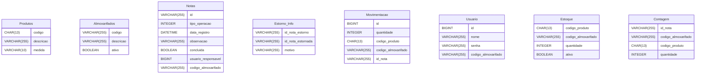

# Delphi_Service_Cadastro_Produtos

# Estoque de Produtos documentation
## Summary

- [Introduction](#introduction)
- [Database Type](#database-type)
- [Table Structure](#table-structure)
	- [Produtos](#produtos)
	- [Almoxarifados](#almoxarifados)
	- [Notas](#notas)
	- [Estorno_Info](#estorno_info)
	- [Movimentacao](#movimentacao)
	- [Usuario](#usuario)
	- [Estoque](#estoque)
	- [Contagem](#contagem)
- [Relationships](#relationships)
- [Database Diagram](#database-diagram)

## Introduction

## Database type

- **Database system:** MySQL
## Table structure

### Produtos

| Name          | Type         | Settings        | References | Note |
| ------------- | ------------ | --------------- | ---------- | ---- |
| **codigo**    | CHAR(13)     | 🔑 PK, not null |            |      |
| **descricao** | VARCHAR(255) | not null        |            |      |
| **medida**    | VARCHAR(10)  | not null        |            |      | 

### Almoxarifados

| Name          | Type         | Settings                | References | Note |
| ------------- | ------------ | ----------------------- | ---------- | ---- |
| **codigo**    | VARCHAR(255) | 🔑 PK, not null         |            |      |
| **descricao** | VARCHAR(255) | not null                |            |      |
| **ativo**     | BOOLEAN      | not null, default: true |            |      | 

### Notas

| Name                    | Type         | Settings                 | References | Note |
| ----------------------- | ------------ | ------------------------ | ---------- | ---- |
| **id**                  | VARCHAR(255) | 🔑 PK, not null          |            |      |
| **tipo_operacao**       | INTEGER      | not null                 |            |      |
| **data_registro**       | DATETIME     | not null                 |            |      |
| **observacao**          | VARCHAR(255) | null                     |            |      |
| **concluida**           | BOOLEAN      | not null, default: false |            |      |
| **usuario_responsavel** | BIGINT       | not null                 |            |      |
| **codigo_almoxarifado** | VARCHAR(255) | not null                 |            |      | 

### Estorno_Info

| Name                  | Type         | Settings         | References | Note |
| --------------------- | ------------ | ---------------- | ---------- | ---- |
| **id_nota_estorno**   | VARCHAR(255) | 🔑 PK, not null  |            |      |
| **id_nota_estornada** | VARCHAR(255) | not null, unique |            |      |
| **motivo**            | VARCHAR(255) | not null         |            |      | 

### Movimentacao

| Name                    | Type         | Settings                       | References | Note |
| ----------------------- | ------------ | ------------------------------ | ---------- | ---- |
| **id**                  | BIGINT       | 🔑 PK, not null, autoincrement |            |      |
| **quantidade**          | INTEGER      | not null                       |            |      |
| **codigo_produto**      | CHAR(13)     | not null                       |            |      |
| **codigo_almoxarifado** | VARCHAR(255) | not null                       |            |      |
| **id_nota**             | VARCHAR(255) | not null                       |            |      | 

### Usuario

| Name                    | Type         | Settings                   | References | Note |
| ----------------------- | ------------ | -------------------------- | ---------- | ---- |
| **id**                  | BIGINT       | 🔑 PK, null, autoincrement |            |      |
| **nome**                | VARCHAR(255) | not null, unique           |            |      |
| **senha**               | VARCHAR(255) | not null                   |            |      |
| **codigo_almoxarifado** | VARCHAR(255) | not null                   |            |      | 

### Estoque

| Name                    | Type         | Settings                | References | Note |
| ----------------------- | ------------ | ----------------------- | ---------- | ---- |
| **codigo_produto**      | CHAR(13)     | 🔑 PK, not null         |            |      |
| **codigo_almoxarifado** | VARCHAR(255) | 🔑 PK, not null         |            |      |
| **quantidade**          | INTEGER      | not null, autoincrement |            |      |
| **ativo**               | BOOLEAN      | not null, default: true |            |      | 

### Contagem

| Name                    | Type         | Settings                | References | Note |
| ----------------------- | ------------ | ----------------------- | ---------- | ---- |
| **id_nota**             | VARCHAR(255) | 🔑 PK, not null         |            |      |
| **codigo_almoxarifado** | VARCHAR(255) | 🔑 PK, not null         |            |      |
| **codigo_produto**      | CHAR(13)     | 🔑 PK, not null         |            |      |
| **quantidade**          | INTEGER      | not null, autoincrement |            |      | 

## Relationships

## Database Diagram

